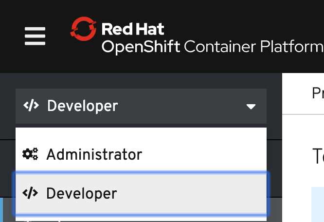
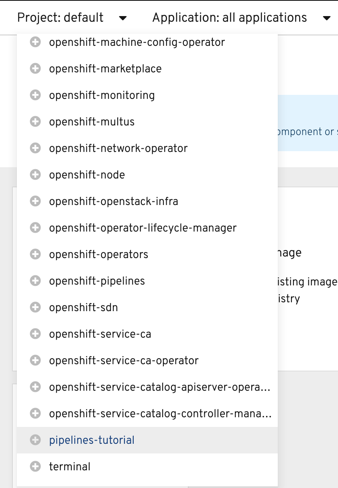
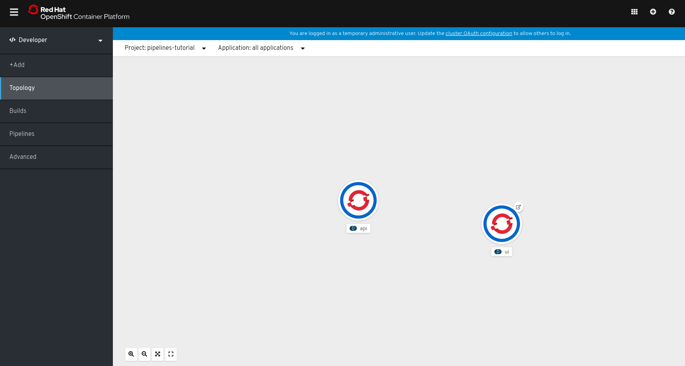
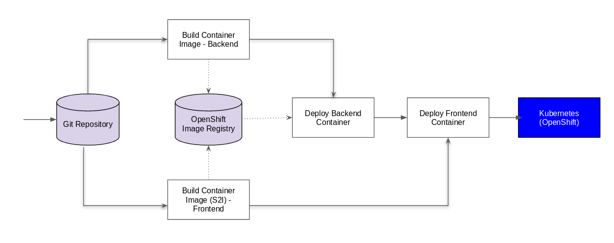
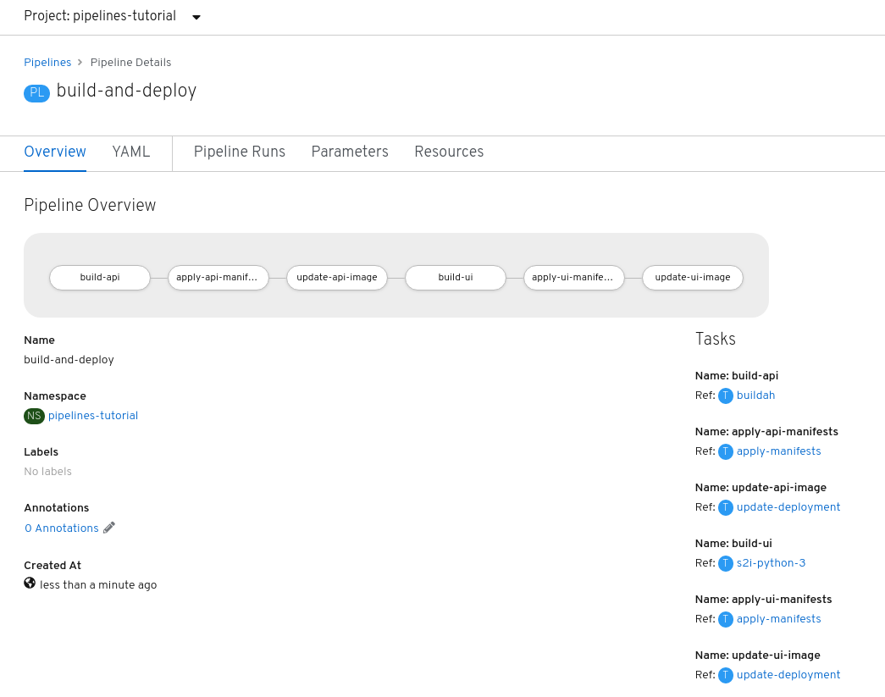

# OpenShift Pipelines Tutorial

Welcome to the OpenShift Pipelines tutorial!

OpenShift Pipelines is a cloud-native, continuous integration and delivery (CI/CD) solution for building pipelines using [Tekton](https://tekton.dev). Tekton is a flexible, Kubernetes-native, open-source CI/CD framework that enables automating deployments across multiple platforms (Kubernetes, serverless, VMs, etc) by abstracting away the underlying details.

OpenShift Pipelines features:
  * Standard CI/CD pipeline definition based on Tekton
  * Build images with Kubernetes tools such as S2I, Buildah, Buildpacks, Kaniko, etc
  * Deploy applications to multiple platforms such as Kubernetes, serverless and VMs
  * Easy to extend and integrate with existing tools
  * Scale pipelines on-demand
  * Portable across any Kubernetes platform
  * Designed for microservices and decentralized teams
  * Integrated with the OpenShift Developer Console

This tutorial walks you through pipeline concepts and how to create and run a simple pipeline for building and deploying a containerized app on OpenShift.

In this tutorial you will:
* [Learn about Tekton concepts](#concepts)
* [Install OpenShift Pipelines](#install-openshift-pipelines)
* [Deploy a Sample Application](#deploy-sample-application)
* [Install Tasks](#install-tasks)
* [Create a Pipeline](#create-pipeline)
* [Trigger a Pipeline](#trigger-pipeline)

## Prerequisites

You need an OpenShift 4 cluster in order to complete this tutorial. If you don't have an existing cluster, go to http://try.openshift.com and register for free in order to get an OpenShift 4 cluster up and running on AWS within minutes.

You will also use the Tekton CLI (`tkn`) through out this tutorial. Download the Tekton CLI by following [instructions](https://github.com/tektoncd/cli#installing-tkn) available on the CLI GitHub repository.

## Concepts

Tekton defines a number of [Kubernetes custom resources](https://kubernetes.io/docs/concepts/extend-kubernetes/api-extension/custom-resources/) as building blocks in order to standardize pipeline concepts and provide a terminology that is consistent across CI/CD solutions. These custom resources are an extension of the Kubernetes API that let users create and interact with these objects using `kubectl` and other Kubernetes tools.

The custom resources needed to define a pipeline are listed below:
* `Task`: a reusable, loosely coupled number of steps that perform a specific task (e.g. building a container image)
* `Pipeline`: the definition of the pipeline and the `Tasks` that it should perform
* `PipelineResource`: inputs (e.g. git repository) and outputs (e.g. image registry) to and out of a pipeline or task
* `TaskRun`: the execution and result of running an instance of task
* `PipelineRun`: the execution and result of running an instance of pipeline, which includes a number of `TaskRuns`


In short, in order to create a pipeline, one does the following:
* Create custom or install [existing](https://github.com/tektoncd/catalog) reusable `Tasks`
* Create a `Pipeline` and `PipelineResources` to define your application's delivery pipeline
* Create a `PipelineRun` to instantiate and invoke the pipeline

For further details on pipeline concepts, refer to the [Tekton documentation](https://github.com/tektoncd/pipeline/tree/master/docs#learn-more) that provides an excellent guide for understanding various parameters and attributes available for defining pipelines.

In the following sections, you will go through each of the above steps to define and invoke a pipeline.

## Install OpenShift Pipelines

OpenShift Pipelines is provided as an add-on on top of OpenShift that can be installed via an operator available in the OpenShift OperatorHub. Follow [these instructions](install-operator.md) in order to install OpenShift Pipelines on OpenShift via the OperatorHub.


## Deploy Sample Application

Create a project for the sample application that you will be using in this tutorial:

```bash
$ oc new-project pipelines-tutorial
```

OpenShift Pipelines automatically adds and configures a `ServiceAccount` named `pipeline` that has sufficient permissions to build and push an image. This
service account will be used later in the tutorial.

Run the following command to see the `pipeline` service account:

```bash
$ oc get serviceaccount pipeline
```

You will use the simple application during this tutorial, which has a [frontend](https://github.com/openshift-pipelines/vote-ui) and [backend](https://github.com/openshift-pipelines/vote-api)

You can also deploy the same applications by applying the artifacts available in k8s directory of the respective repo

If you deploy the application directly, you should be able to see the deployment in the OpenShift Web Console by switching over to the **Developer** perspective of the OpenShift web console. Change from **Administrator** to **Developer** from the drop down as shown below:



Make sure you are on the `pipelines-tutorial` project by selecting it from the **Project** dropdown menu. Either search for `pipelines-tutorial` in the search bar or scroll down until you find `pipelines-tutorial` and click on the name of your project.



<!--
On the **Topology** view of the **Developer** perspective, you will be able to see the resources you just created.


-->

## Install Tasks

Tasks consist of a number of steps that are executed sequentially. Each task is executed in a separate container within the same pod. They can also have inputs and outputs in order to interact with other tasks in the pipeline.

Here is an example of a Maven task for building a Maven-based Java application:

```yaml
apiVersion: tekton.dev/v1alpha1
kind: Task
metadata:
  name: maven-build
spec:
  inputs:
    resources:
    - name: workspace-git
      targetPath: /
      type: git
  steps:
  - name: build
    image: maven:3.6.0-jdk-8-slim
    command:
    - /usr/bin/mvn
    args:
    - install
```

When a task starts running, it starts a pod and runs each step sequentially in a separate container on the same pod. This task happens to have a single step, but tasks can have multiple steps, and, since they run within the same pod, they have access to the same volumes in order to cache files, access configmaps, secrets, etc. As mentioned previously, tasks can receive inputs (e.g. a git repository) and produce outputs (e.g. an image in a registry).

Note that only the requirement for a git repository is declared on the task and not a specific git repository to be used. That allows tasks to be reusable for multiple pipelines and purposes. You can find more examples of reusable tasks in the [Tekton Catalog](https://github.com/tektoncd/catalog) and [OpenShift Catalog](https://github.com/openshift/pipelines-catalog) repositories.

Install the `apply-manifests` and `update-deployment` tasks from the repository using `oc` or `kubectl`, which you will need for creating a pipeline in the next section:

```bash
$ oc create -f https://raw.githubusercontent.com/openshift/pipelines-tutorial/master/pipeline/update_deployment_task.yaml
$ oc create -f https://raw.githubusercontent.com/openshift/pipelines-tutorial/master/pipeline/apply_manifest_task.yaml

```

You can take a look at the tasks you created using the [Tekton CLI](https://github.com/tektoncd/cli/releases):

```
$ tkn task ls

NAME                AGE
apply-manifests     10 seconds ago
update-deployment   4 seconds ago
```

We will be using `buildah` and`s2i-python-3` tasks also which gets installed along with Operator. Operator installs few ClusterTask which you can see.

```
$ tkn clustertask ls
NAME                       AGE
buildah                    4 minutes ago
buildah-v0-10-0            4 minutes ago
openshift-client           4 minutes ago
openshift-client-v0-10-0   4 minutes ago
s2i                        4 minutes ago
s2i-go                     4 minutes ago
s2i-go-v0-10-0             4 minutes ago
s2i-java-11                4 minutes ago
s2i-java-11-v0-10-0        4 minutes ago
s2i-java-8                 4 minutes ago
s2i-java-8-v0-10-0         4 minutes ago
s2i-nodejs                 4 minutes ago
s2i-nodejs-v0-10-0         4 minutes ago
s2i-perl                   4 minutes ago
s2i-perl-v0-10-0           4 minutes ago
s2i-php                    4 minutes ago
s2i-php-v0-10-0            4 minutes ago
s2i-python-3               4 minutes ago
s2i-python-3-v0-10-0       4 minutes ago
s2i-ruby                   4 minutes ago
s2i-ruby-v0-10-0           4 minutes ago
s2i-v0-10-0                4 minutes ago
```

## Create Pipeline

A pipeline defines a number of tasks that should be executed and how they interact with each other via their inputs and outputs.

In this tutorial, you will create a pipeline that takes the source code of the application from GitHub and then builds and deploys it on OpenShift.



Here is the YAML file that represents the above pipeline:

```yaml
apiVersion: tekton.dev/v1alpha1
kind: Pipeline
metadata:
  name: build-and-deploy
spec:
  resources:
    - name: api-repo
      type: git
    - name: api-image
      type: image
    - name: ui-repo
      type: git
    - name: ui-image
      type: image

  tasks:
    - name: build-api
      taskRef:
        name: buildah
        kind: ClusterTask
      resources:
        inputs:
          - name: source
            resource: api-repo
        outputs:
          - name: image
            resource: api-image
      params:
        - name: TLSVERIFY
          value: "false"

    - name: apply-api-manifests
      taskRef:
        name: apply-manifests
      resources:
        inputs:
          - name: source
            resource: api-repo
      runAfter:
        - build-api

    - name: update-api-image
      taskRef:
        name: update-deployment
      resources:
        inputs:
          - name: image
            resource: api-image
      params:
        - name: deployment
          value: "api"
      runAfter:
        - apply-api-manifests

    - name: build-ui
      taskRef:
        name: s2i-python-3
        kind: ClusterTask
      resources:
        inputs:
          - name: source
            resource: ui-repo
        outputs:
          - name: image
            resource: ui-image
      params:
        - name: TLSVERIFY
          value: "false"

    - name: apply-ui-manifests
      taskRef:
        name: apply-manifests
      resources:
        inputs:
          - name: source
            resource: ui-repo
      runAfter:
        - build-ui
        - update-api-image

    - name: update-ui-image
      taskRef:
        name: update-deployment
      resources:
        inputs:
          - name: image
            resource: ui-image
      params:
        - name: deployment
          value: "ui"
      runAfter:
        - apply-ui-manifests
```

This pipeline performs the following:
1. Clones the source code of the frontend application from a git repository (`api-repo`
   resource) and the backend application from a git repository (`ui-repo`resource)
2. Builds the container image of frontend using the `s2i-python-3` task that generates a
   Dockerfile for the application using [Source-to-Image (S2I)](https://docs.openshift.com/container-platform/4.1/builds/understanding-image-builds.html#build-strategy-s2i_understanding-image-builds).
   and uses [Buildah](https://buildah.io/) to build the image
3. Builds the container image of backend using the `buildah` task
   that uses [Buildah](https://buildah.io/) to build the image
4. The application image is pushed to an image registry (`api-image` and `ui-image` resource)
5. The new application image is deployed on OpenShift using the `apply-manifests` and `update-deployment` tasks.

You might have noticed that there are no references to the git
repository or the image registry it will be pushed to. That's because pipeline in Tekton
are designed to be generic and re-usable across environments and stages through
the application's lifecycle. Pipelines abstract away the specifics of the git
source repository and image to be produced as `PipelineResources`. When triggering a
pipeline, you can provide different git repositories and image registries to be
used during pipeline execution. Be patient! You will do that in a little bit in
the next section.

The execution order of task is determined by dependencies that are defined between the tasks via inputs and outputs as well as explicit orders that are defined via `runAfter`.

Create the pipeline by running the following:

```bash
$ oc create -f https://raw.githubusercontent.com/openshift/pipelines-tutorial/master/pipeline/pipeline.yaml
```

Alternatively, in the OpenShift web console, you can click on the **+** at the top right of the screen while you are in the **pipelines-tutorial** project:


Upon creating the pipeline via the web console, you will be taken to a **Pipeline Details** page that gives an overview of the pipeline you created.
<!-- >



-->

Check the list of pipelines you have created using the CLI:

```
$ tkn pipeline ls

NAME               AGE            LAST RUN   STARTED   DURATION   STATUS
build-and-deploy   1 minute ago   ---        ---       ---        ---
```

## Trigger Pipeline

Now that the pipeline is created, you can trigger it to execute the tasks
specified in the pipeline.

First, you should create a number of `PipelineResources` that contain the specifics of the git repository and image registry to be used in the pipeline during execution. Expectedly, these are also reusable across multiple pipelines.

The following `PipelineResource` defines the git repository for the frontend application:

```yaml
apiVersion: tekton.dev/v1alpha1
kind: PipelineResource
metadata:
  name: ui-repo
spec:
  type: git
  params:
    - name: url
      value: http://github.com/openshift-pipelines/vote-ui.git
```

And the following defines the OpenShift internal image registry for the frontend image to be pushed to:

```yaml
apiVersion: tekton.dev/v1alpha1
kind: PipelineResource
metadata:
  name: ui-image
spec:
  type: image
  params:
    - name: url
      value: image-registry.openshift-image-registry.svc:5000/pipelines-tutorial/ui:latest
```

And the following `PipelineResource` defines the git repository for the backend application:

```yaml
apiVersion: tekton.dev/v1alpha1
kind: PipelineResource
metadata:
  name: api-repo
spec:
  type: git
  params:
    - name: url
      value: http://github.com/openshift-pipelines/vote-api.git
```

And the following defines the OpenShift internal image registry for the backend image to be pushed to:

```yaml
apiVersion: tekton.dev/v1alpha1
kind: PipelineResource
metadata:
  name: api-image
spec:
  type: image
  params:
    - name: url
      value: image-registry.openshift-image-registry.svc:5000/pipelines-tutorial/api:latest
```

Create the above pipeline resources via the OpenShift web console or by running the following:

```bash
$ oc create -f https://raw.githubusercontent.com/openshift/pipelines-tutorial/master/pipeline/resources.yaml
```

> **Note** :-
>
>If you are not into the `pipelines-tutorial` namespace, and using another namespace for the tutorial steps, please make sure you update the
frontend and backend image resource to the correct url with your namespace name like so :
>
>`image-registry.openshift-image-registry.svc:5000/<namespace-name>/api:latest`

You can see the list of resources created using `tkn`:

```bash
$ tkn resource ls

NAME        TYPE    DETAILS
api-repo    git     url: http://github.com/openshift-pipelines/vote-api.git
ui-repo     git     url: http://github.com/openshift-pipelines/vote-ui.git
api-image   image   url: image-registry.openshift-image-registry.svc:5000/pipelines-tutorial/api:latest
ui-image    image   url: image-registry.openshift-image-registry.svc:5000/pipelines-tutorial/ui:latest
```

A `PipelineRun` is how you can start a pipeline and tie it to the git and image resources that should be used for this specific invocation. You can start the pipeline using `tkn`:

```bash
$ tkn pipeline start build-and-deploy
? Choose the git resource to use for api-repo: api-repo (http://github.com/openshift-pipelines/vote-api.git)
? Choose the image resource to use for api-image: api-image (image-registry.openshift-image-registry.svc:5000/pipelines-tutorial/api:latest)
? Choose the git resource to use for ui-repo: ui-repo (http://github.com/openshift-pipelines/vote-ui.git)
? Choose the image resource to use for ui-image: ui-image (image-registry.openshift-image-registry.svc:5000/pipelines-tutorial/ui:latest)
Pipelinerun started: build-and-deploy-run-z2rz8

In order to track the pipelinerun progress run:
tkn pipelinerun logs build-and-deploy-run-z2rz8 -f -n pipelines-tutorial
```

As soon as you start the `build-and-deploy` pipeline, a pipelinerun will be instantiated and pods will be created to execute the tasks that are defined in the pipeline.

```bash
$ tkn pipeline list
NAME               AGE             LAST RUN                     STARTED          DURATION   STATUS
build-and-deploy   6 minutes ago   build-and-deploy-run-z2rz8   36 seconds ago   ---        Running

```

Check out the logs of the pipelinerun as it runs using the `tkn pipeline logs` command which interactively allows you to pick the pipelinerun of your interest and inspect the logs:

```
$ tkn pipeline logs -f
? Select pipeline : build-and-deploy
```

After a few minutes, the pipeline should finish successfully.

```bash
$ tkn pipeline list

NAME               AGE              LAST RUN                     STARTED         DURATION    STATUS
build-and-deploy   11 minutes ago   build-and-deploy-run-z2rz8   5 minutes ago   5 minutes   Succeeded
```

Looking back at the project, you should see that the images are successfully built and deployed.


You can get the route of the application by executing the following command and access the application

```bash
  oc get route ui --template='http://{{.spec.host}}'
```


If you want to re-run the pipeline again, you can use the following short-hand command to rerun the last pipelinerun again that uses the same pipeline resources and service account used in the previous pipeline run:

```
tkn pipeline start build-and-deploy --last
```
