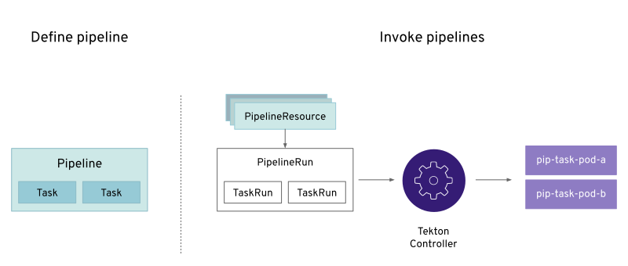
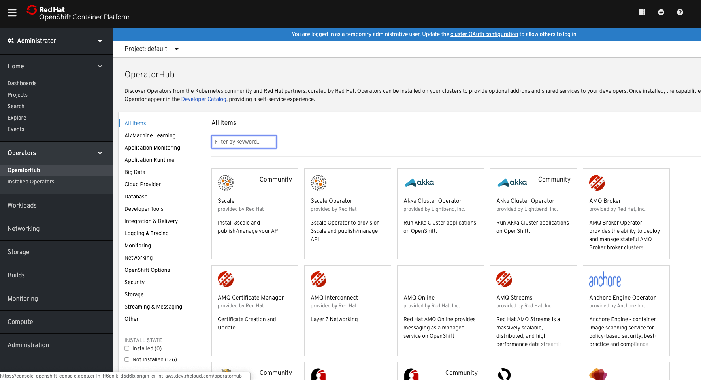
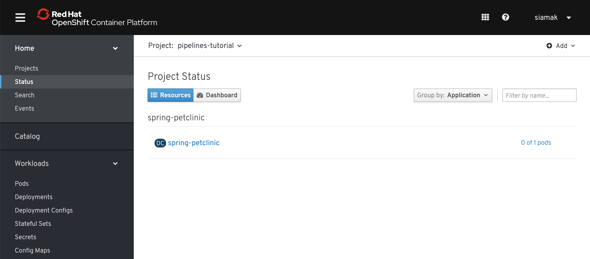
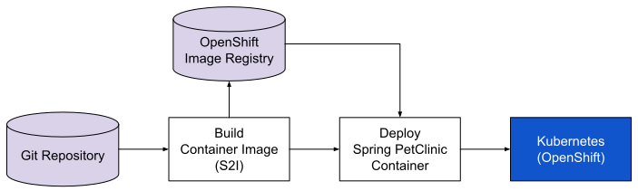
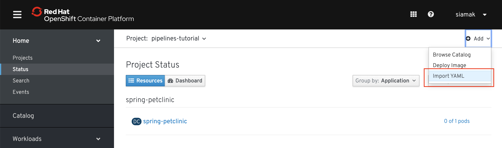
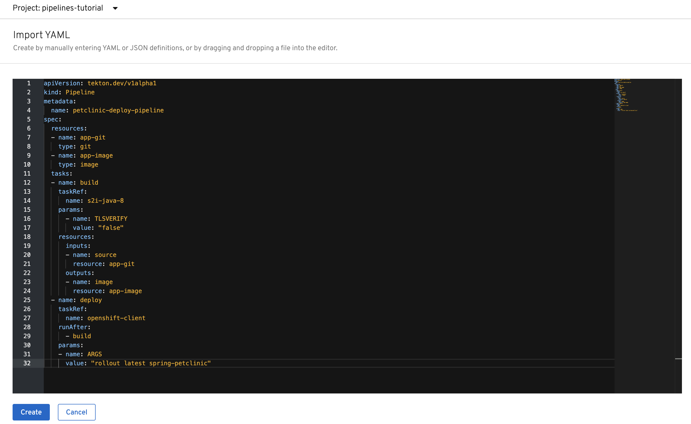
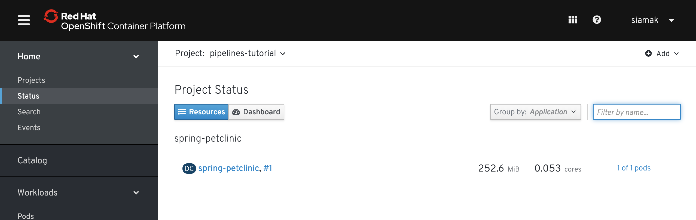

# OpenShift Pipelines Tutorial

Welcome to the OpenShift Pipelines tutorial!

OpenShift Pipelines is a cloud-native, continuous integration and delivery (CI/CD) solution for building pipelines using [Tekton](https://tekton.dev). Tekton is a flexible, Kubernetes-native, open-source CI/CD framework that enables automating deployments across multiple platforms (Kubernetes, serverless, VMs, etc) by abstracting away the underlying details.

OpenShift Pipelines features:
  * Standard CI/CD pipeline definition based on Tekton
  * Build images with Kubernetes tools such as `S2I`, `Buildah`, `Buildpacks`, `Kaniko`, etc
  * Deploy applications to multiple platforms such as Kubernetes, serverless and VMs
  * Easy to extend and integrate with existing tools
  * Scale pipelines on-demand
  * Portable across any Kubernetes platform
  * Designed for microservices and decentralized teams
  * Integrated with the OpenShift Developer Console

This tutorial walks you through pipeline concepts and how to create and run a simple pipeline for building and deploying a containerized app on OpenShift.

In this tutorial you will:
* [Learn about Tekton concepts](#concepts)
* [Install OpenShift Pipelines](#install-openshift-pipelines)
* [Deploy a Sample Application](#deploy-sample-application)
* [Install Tasks](#install-tasks)
* [Create a Pipeline](#create-pipeline)
* [Trigger a Pipeline](#trigger-pipeline)

## Prerequisite

You need an OpenShift 4 cluster in order to complete this tutorial. If you don't have an existing cluster, go to http://try.openshift.com and register for free in order to get an OpenShift 4 cluster up and running on AWS within minutes.

You will also use the Tekton CLI (`tkn`) through out this tutorial. Download the [Tekton CLI](https://github.com/tektoncd/cli#getting-started) and copy it to a location on your `PATH`.

## Concepts

Tekton defines a number of [Kubernetes custom resources](https://kubernetes.io/docs/concepts/extend-kubernetes/api-extension/custom-resources/) as building blocks in order to standardize pipeline concepts and provide a terminology that is consistent across CI/CD solutions. These custom resources (CR) are an extension of Kubernetes that let users create and interact with these objects using `kubectl` and other Kubernetes tools.

The custom resources needed to define a pipeline are:
* `Task`: a reusable, loosely coupled number of steps that perform a specific task (e.g., building a container image)
* `Pipeline`: the definition of the pipeline and the `Task`s that it should perform
* `PipelineResource`: inputs (e.g., git repository) and outputs (e.g., image registry) to and out of a pipeline or task
* `TaskRun`: the result of running an instance of task
* `PipelineRun`: the result of running an instance of pipeline, which includes a number of `TaskRun`s



In short, in order to create a pipeline, one does the following:
* Create custom or install [existing](https://github.com/tektoncd/catalog) reusable `Tasks`
* Create a `Pipeline` and `PipelneResource`s to define your application's delivery pipeline
* Create a `PipelineRun` to instantiate and invoke the pipeline

For further details on pipeline concepts, refer to the [Tekton documentation](https://github.com/tektoncd/pipeline/tree/master/docs#learn-more) that provides an excellent guide for understanding various parameters and attributes available for defining pipelines.

In the following sections, you will go through each of the above steps to define and invoke a pipeline.

## Install OpenShift Pipelines

OpenShift Pipelines is provided as an add-on on top of OpenShift that can be installed via an operator available in the OpenShift OperatorHub. Follow [these instructions](install-operator.md) in order to install OpenShift Pipelines on OpenShift via the OperatorHub.



## Deploy Sample Application

Create a project for the sample application that you will be using in this tutorial:

```bash
oc new-project pipelines-tutorial
```

Building container images using build tools such as `S2I`, `Buildah`, `Kaniko`, etc require privileged access to the cluster. OpenShift default security settings do not allow privileged containers unless specifically configured. Create a service account for running pipelines and enable it to run privileged pods for building images:

```
oc create serviceaccount pipeline
oc adm policy add-scc-to-user privileged -z pipeline
oc adm policy add-role-to-user edit -z pipeline
```

You will use the [Spring PetClinic](https://github.com/spring-projects/spring-petclinic) sample application during this tutorial, which is a simple Spring Boot application.

Create the Kubernetes objects for deploying the PetClinic app on OpenShift. The deployment will not complete since there are no container images built for the PetClinic application yet. That you will do in the following sections through a CI/CD pipeline:

```bash
oc create -f https://raw.githubusercontent.com/openshift/pipelines-tutorial/master/resources/petclinic.yaml
```

You should be able to see the deployment in the OpenShift Web Console.



## Install Tasks

`Task`s consist of a number of steps that are executed sequentially. Each `task` is executed in a separate container within the same pod. They can also have inputs and outputs in order to interact with other tasks in the pipeline.

Here is an example of a Maven task for building a Maven-based Java application:

```yaml
apiVersion: tekton.dev/v1alpha1
kind: Task
metadata:
  name: maven-build
spec:
  inputs:
    resources:
    - name: workspace-git
      targetPath: /
      type: git
  steps:
  - name: build
    image: maven:3.6.0-jdk-8-slim
    command:
    - /usr/bin/mvn
    args:
    - install
```

When a `task` starts running, it starts a pod and runs each `step` sequentially in a separate container on the same pod. This task happens to have a single step, but tasks can have multiple steps, and, since they run within the same pod, they have access to the same volumes in order to cache files, access configmaps, secrets, etc. `Task`s can also receive inputs (e.g., a git repository) and outputs (e.g., an image in a registry) in order to interact with each other.

Note that only the requirement for a git repository is declared on the task and not a specific git repository to be used. That allows `task`s to be reusable for multiple pipelines and purposes. You can find more examples of reusable `task`s in the [Tekton Catalog](https://github.com/tektoncd/catalog) and [OpenShift Catalog](https://github.com/openshift/pipelines-catalog) repositories.

Install the `openshift-client` and `s2i-java` tasks from the catalog repository using `oc` or `kubectl`, which you will need for creating a pipeline in the next section:

```bash
$ oc create -f https://raw.githubusercontent.com/tektoncd/catalog/master/openshift-client/openshift-client-task.yaml
$ oc create -f https://raw.githubusercontent.com/openshift/pipelines-catalog/master/s2i-java-8/s2i-java-8-task.yaml

```

You can take a look at the list of install `task`s using the [Tekton CLI](https://github.com/tektoncd/cli/releases):

```
$ tkn task ls
NAME               AGE
openshift-client   58 seconds ago
s2i-java-8         1 minute ago
```

## Create Pipeline

A pipeline defines a number of tasks that should be executed and how they interact with each other via their inputs and outputs.

In this tutorial, you will create a pipeline that takes the source code of PetClinic application from GitHub and then builds and deploys it on OpenShift using [Source-to-Image (S2I)](https://docs.openshift.com/container-platform/4.1/builds/understanding-image-builds.html#build-strategy-s2i_understanding-image-builds).

<p align="center"></div>

Here is the YAML file that represents the above pipeline:

```yaml
apiVersion: tekton.dev/v1alpha1
kind: Pipeline
metadata:
  name: deploy-pipeline
spec:
  resources:
  - name: app-git
    type: git
  - name: app-image
    type: image
  tasks:
  - name: build
    taskRef:
      name: s2i-java-8
    params:
      - name: TLSVERIFY
        value: "false"
    resources:
      inputs:
      - name: source
        resource: app-git
      outputs:
      - name: image
        resource: app-image
  - name: deploy
    taskRef:
      name: openshift-client
    runAfter:
      - build
    params:
    - name: ARGS
      value: "rollout latest spring-petclinic"
```

This pipeline performs the following:
1. Clones the source code of the application from a Git repository (`app-git` resource)
3. Builds the container image using the `s2i-java-8` task that generates a Dockerfile for the application and uses [Buildah](https://buildah.io/) to build the image
4. The application image is pushed to an image registry (`app-image` resource)
5. The new application image is deployed on OpenShift using the `openshift-cli`

You might have noticed that there are no references to the PetClinic Git repository and its image in the registry. That's because `Pipeline`s in Tekton are designed to be generic and re-usable across environments and stages through the application's lifecycle. `Pipeline`s abstract away the specifics of the Git source repository and image to be produced as `resource`s. When triggering a pipeline, you can provide different Git repositories and image registries to be used during pipeline execution. Be patient! You will do that in a little bit in the next section.

The execution order of `task`s is determined by dependencies that are defined between the `task`s via `inputs` and `outputs` as well as explicit orders that are defined via `runAfter`.

Create the pipeline by running the following:

```bash
oc create -f https://raw.githubusercontent.com/openshift/pipelines-tutorial/master/resources/deploy-pipeline.yaml
```

Alternatively, in the OpenShift web console, you can click on **Add &#8594; Import YAML** at the top right of the screen while you are in the **pipelines-tutorial** project, paste the YAML into the textfield, and click on **Create**.






Check the list of pipelines you have created using the CLI:

```
$ tkn pipeline ls
NAME             AGE              LAST RUN   STARTED   DURATION   STATUS
deploy-pipeline  25 seconds ago   ---        ---       ---        ---
```

## Trigger Pipeline

Now that the pipeline is created, you can trigger it to execute the tasks specified in the pipeline. Triggering pipelines is an area that is under development and in the next release it will be possible to be done via the OpenShift web console and Tekton CLI. In this tutorial, you will trigger the pipeline through creating the Kubernetes objects (the hard way!) in order to learn the mechanics of triggering.

First, you should create a number of `PipelineResource`s that contain the specifics of the Git repository and image registry to be used in the pipeline during execution. Expectedly, these are also reusable across multiple pipelines.

The following `PipelineResource` defines the Git repository and reference for the PetClinic application:

```yaml
apiVersion: tekton.dev/v1alpha1
kind: PipelineResource
metadata:
  name: petclinic-git
spec:
  type: git
  params:
  - name: url
    value: https://github.com/spring-projects/spring-petclinic
```

And the following defines the OpenShift internal registry for the PetClinic image to be pushed to:

```yaml
apiVersion: tekton.dev/v1alpha1
kind: PipelineResource
metadata:
  name: petclinic-image
spec:
  type: image
  params:
  - name: url
    value: image-registry.openshift-image-registry.svc:5000/pipelines-tutorial/spring-petclinic
```

Create the above pipeline resources via the OpenShift web console or by running the following:

```bash
oc create -f https://raw.githubusercontent.com/openshift/pipelines-tutorial/master/resources/petclinic-resources.yaml
```

A `PipelineRun` is how you can trigger a pipeline and tie it to the Git and image resources that should be used for this specific invocation:

```yaml
apiVersion: tekton.dev/v1alpha1
kind: PipelineRun
metadata:
  generateName: petclinic-deploy-pipelinerun-
spec:
  pipelineRef:
    name: deploy-pipeline
  trigger:
    type: manual
  serviceAccount: 'pipeline'
  resources:
  - name: app-git
    resourceRef:
      name: petclinic-git
  - name: app-image
    resourceRef:
      name: petclinic-image
```

Trigger the `Pipeline` to deploy the Spring PetClinic app by entering the `PipelineRun` YAML definition above into the web console or run the command below:

```bash
oc create -f https://raw.githubusercontent.com/openshift/pipelines-tutorial/master/resources/petclinic-deploy-pipelinerun.yaml
```

The pipeline is then instantiated and pods are created to execute the tasks that are defined in the pipeline. After a few minutes, the pipeline should finish successfully.

```
# tkn pr ls
NAME                                 STARTED         DURATION    STATUS
petclinic-deploy-pipelinerun-lkq7d   7 minutes ago   3 minutes   Succeeded
```

Check the pipelinerun logs as it executes:

```
$ tkn pr logs petclinic-deploy-pipelinerun-lkq7d -f
...

[s2i-java-8 : nop] Build successful

[openshift-client : oc] deploymentconfig.apps.openshift.io/spring-petclinic rolled out

[openshift-client : nop] Build successful
```

Looking back at the project, you should see that the PetClinic image is successfully built and deployed.


