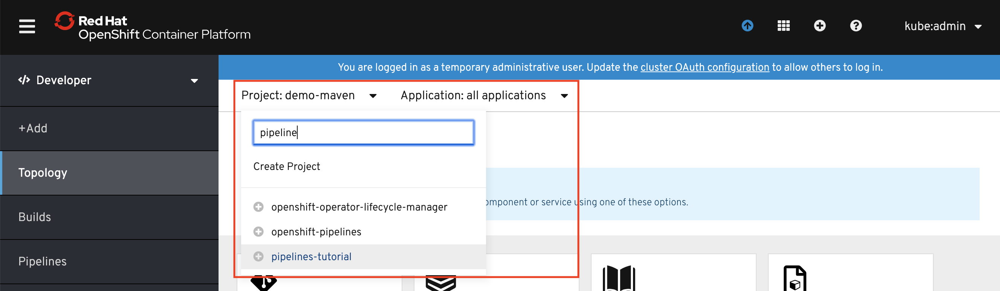
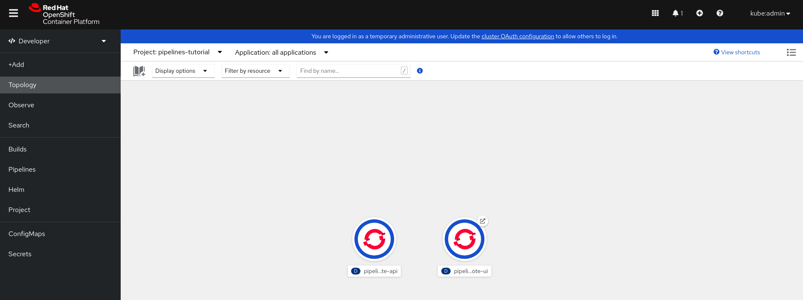
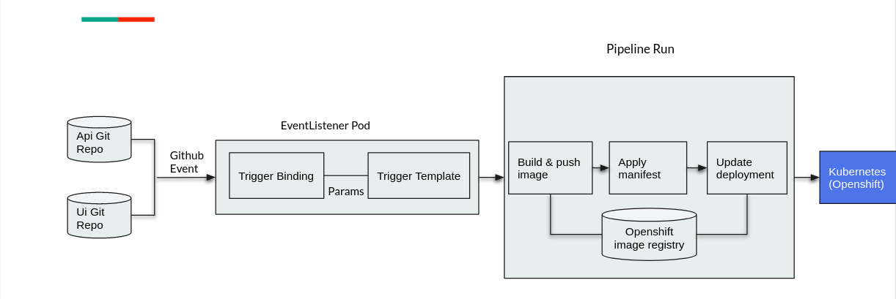
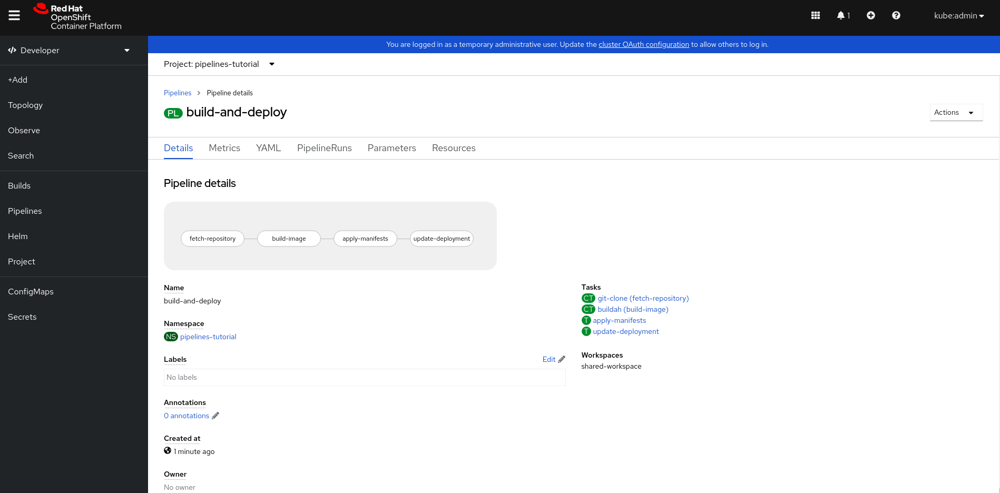
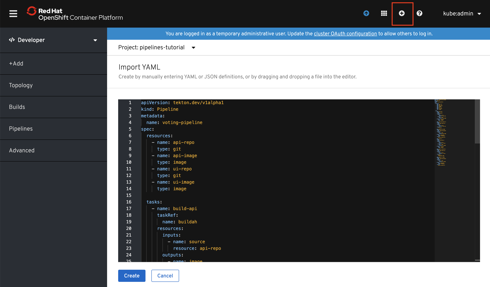
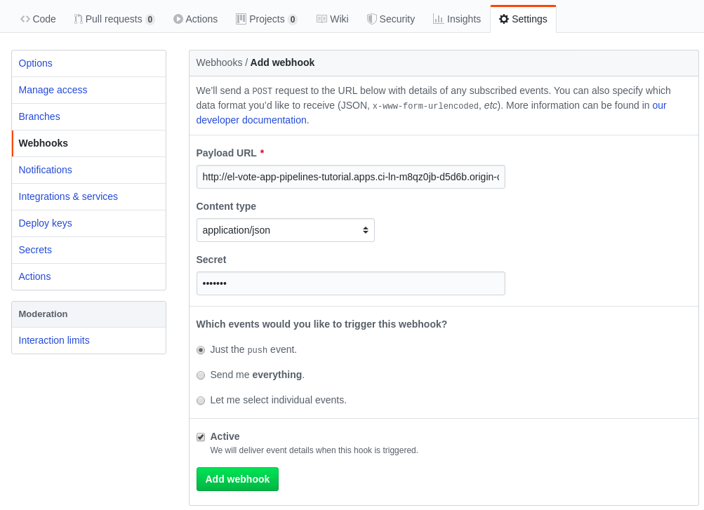
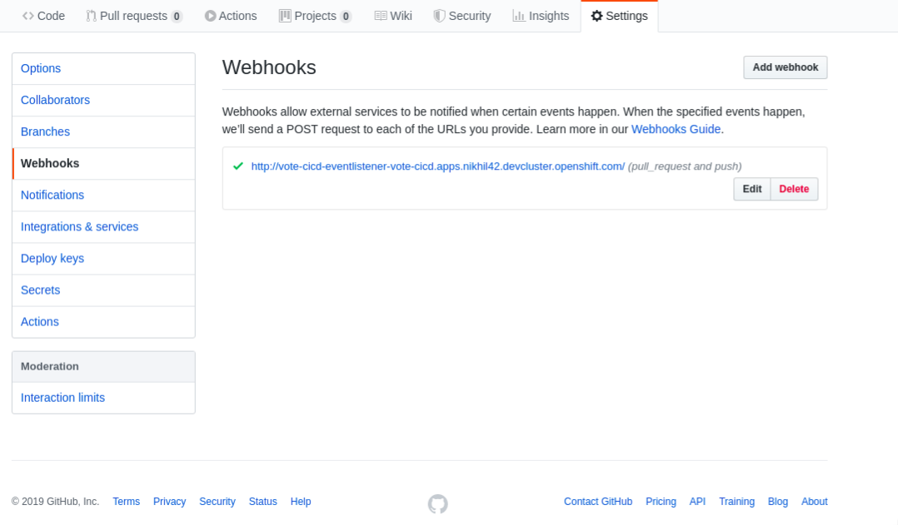

# OpenShift Pipelines Tutorial

Welcome to the OpenShift Pipelines tutorial!

OpenShift Pipelines is a cloud-native, continuous integration and delivery (CI/CD) solution for building pipelines using [Tekton](https://tekton.dev). Tekton is a flexible, Kubernetes-native, open-source CI/CD framework that enables automating deployments across multiple platforms (Kubernetes, serverless, VMs, etc) by abstracting away the underlying details.

OpenShift Pipelines features:
  * Standard CI/CD pipeline definition based on Tekton
  * Build images with Kubernetes tools such as S2I, Buildah, Buildpacks, Kaniko, etc
  * Deploy applications to multiple platforms such as Kubernetes, serverless and VMs
  * Easy to extend and integrate with existing tools
  * Scale pipelines on-demand
  * Portable across any Kubernetes platform
  * Designed for microservices and decentralized teams
  * Integrated with the OpenShift Developer Console

This tutorial walks you through pipeline concepts and how to create and run a simple pipeline for building and deploying a containerized app on OpenShift, and in this tutorial, we will use `Triggers` to handle a real GitHub webhook request to kickoff a PipelineRun.

In this tutorial you will:
* [Learn about Tekton concepts](#concepts)
* [Install OpenShift Pipelines](#install-openshift-pipelines)
* [Deploy a Sample Application](#deploy-sample-application)
* [Install Tasks](#install-tasks)
* [Create a Pipeline](#create-pipeline)
* [Trigger a Pipeline](#trigger-pipeline)

## Prerequisites

You need an OpenShift 4 cluster in order to complete this tutorial. If you don't have an existing cluster, go to http://try.openshift.com and register for free in order to get an OpenShift 4 cluster up and running on AWS within minutes.

You will also use the Tekton CLI (`tkn`) through out this tutorial. Download the Tekton CLI by following [instructions](https://github.com/tektoncd/cli#installing-tkn) available on the CLI GitHub repository.

## Concepts

Tekton defines a number of [Kubernetes custom resources](https://kubernetes.io/docs/concepts/extend-kubernetes/api-extension/custom-resources/) as building blocks in order to standardize pipeline concepts and provide a terminology that is consistent across CI/CD solutions. These custom resources are an extension of the Kubernetes API that let users create and interact with these objects using `kubectl` and other Kubernetes tools.

The custom resources needed to define a pipeline are listed below:
* `Task`: a reusable, loosely coupled number of steps that perform a specific task (e.g. building a container image)
* `Pipeline`: the definition of the pipeline and the `Tasks` that it should perform
* `TaskRun`: the execution and result of running an instance of task
* `PipelineRun`: the execution and result of running an instance of pipeline, which includes a number of `TaskRuns`


In short, in order to create a pipeline, one does the following:
* Create custom or install [existing](https://github.com/tektoncd/catalog) reusable `Tasks`
* Create a `Pipeline` and `PipelineResources` to define your application's delivery pipeline
* Create a `PersistentVolumeClaim` to provide the volume/filesystem for pipeline execution or provide a `VolumeClaimTemplate` which creates a `PersistentVolumeClaim`
* Create a `PipelineRun` to instantiate and invoke the pipeline

For further details on pipeline concepts, refer to the [Tekton documentation](https://github.com/tektoncd/pipeline/tree/v0.19.0/docs) that provides an excellent guide for understanding various parameters and attributes available for defining pipelines.

The Tekton API enables functionality to be separated from configuration (e.g.
[Pipelines](https://github.com/tektoncd/pipeline/blob/v0.19.0/docs/pipelines.md)
vs
[PipelineRuns](https://github.com/tektoncd/pipeline/blob/v0.19.0/docs/pipelineruns.md))
such that steps can be reusable.

Triggers extends the Tekton
architecture with the following CRDs:

- [`TriggerTemplate`](https://github.com/tektoncd/triggers/blob/v0.10.2/docs/triggertemplates.md) - Templates resources to be
  created (e.g. Create PipelineResources and PipelineRun that uses them)
- [`TriggerBinding`](https://github.com/tektoncd/triggers/blob/v0.10.2/docs/triggerbindings.md) - Validates events and extracts
  payload fields
- [`Trigger`](https://github.com/tektoncd/triggers/blob/v0.10.2/docs/triggers.md) - combines TriggerTemplate, TriggerBindings and interceptors.
- [`EventListener`](https://github.com/tektoncd/triggers/blob/v0.10.2/docs/eventlisteners.md) -  provides an
  [addressable](https://github.com/knative/eventing/blob/v0.10.2/docs/spec/interfaces.md)
  endpoint (the event sink). `Trigger` is referenced inside the EventListener Spec. It uses the extracted event parameters from each
  `TriggerBinding` (and any supplied static parameters) to create the resources
  specified in the corresponding `TriggerTemplate`. It also optionally allows an
  external service to pre-process the event payload via the `interceptor` field.
- [`ClusterTriggerBinding`](https://github.com/tektoncd/triggers/blob/v0.10.2/docs/clustertriggerbindings.md) - A cluster-scoped
  TriggerBinding

Using `tektoncd/triggers` in conjunction with `tektoncd/pipeline` enables you to
easily create full-fledged CI/CD systems where the execution is defined
**entirely** through Kubernetes resources.

You can learn more about `triggers` by checking out the [docs](https://github.com/tektoncd/triggers/blob/v0.10.2/docs/README.md)

In the following sections, you will go through each of the above steps to define and invoke a pipeline.

## Install OpenShift Pipelines

OpenShift Pipelines is provided as an add-on on top of OpenShift that can be installed via an operator available in the OpenShift OperatorHub. Follow [these instructions](install-operator.md) in order to install OpenShift Pipelines on OpenShift via the OperatorHub.


## Deploy Sample Application

Create a project for the sample application that you will be using in this tutorial:

```bash
$ oc new-project pipelines-tutorial
```

OpenShift Pipelines automatically adds and configures a `ServiceAccount` named `pipeline` that has sufficient permissions to build and push an image. This
service account will be used later in the tutorial.

Run the following command to see the `pipeline` service account:

```bash
$ oc get serviceaccount pipeline
```

You will use the simple application during this tutorial, which has a [frontend](https://github.com/openshift-pipelines/vote-ui) and [backend](https://github.com/openshift-pipelines/vote-api)

You can also deploy the same applications by applying the artifacts available in k8s directory of the respective repo

If you deploy the application directly, you should be able to see the deployment in the OpenShift Web Console by switching over to the **Developer** perspective of the OpenShift Web Console. Change from **Administrator** to **Developer** from the drop down as shown below:


Make sure you are on the `pipelines-tutorial` project by selecting it from the **Project** dropdown menu. Either search for `pipelines-tutorial` in the search bar or scroll down until you find `pipelines-tutorial` and click on the name of your project.



<!--
On the **Topology** view of the **Developer** perspective, you will be able to see the resources you just created.


-->

## Install Tasks

Tasks consist of a number of steps that are executed sequentially. Tasks are executed/run by creating TaskRuns. A TaskRun will schedule a Pod. Each step is executed in a separate container within the same pod. They can also have inputs and outputs in order to interact with other tasks in the pipeline.

Here is an example of a Maven task for building a Maven-based Java application:

```yaml
apiVersion: tekton.dev/v1beta1
kind: Task
metadata:
  name: maven-build
spec:
  workspaces:
   -name: filedrop
  steps:
  - name: build
    image: maven:3.6.0-jdk-8-slim
    command:
    - /usr/bin/mvn
    args:
    - install
```

When a task starts running, it starts a pod and runs each step sequentially in a separate container on the same pod. This task happens to have a single step, but tasks can have multiple steps, and, since they run within the same pod, they have access to the same volumes in order to cache files, access configmaps, secrets, etc. You can specify volume using workspace. It is recommended that Tasks uses at most one writeable Workspace. Workspace can be secret, pvc, config or emptyDir.

Note that only the requirement for a git repository is declared on the task and not a specific git repository to be used. That allows tasks to be reusable for multiple pipelines and purposes. You can find more examples of reusable tasks in the [Tekton Catalog](https://github.com/tektoncd/catalog) and [OpenShift Catalog](https://github.com/openshift/pipelines-catalog/tree/v0.19.0) repositories.

Install the `apply-manifests` and `update-deployment` tasks from the repository using `oc` or `kubectl`, which you will need for creating a pipeline in the next section:

```bash
$ oc create -f https://raw.githubusercontent.com/openshift/pipelines-tutorial/pipelines-1.3/01_pipeline/01_apply_manifest_task.yaml

$ oc create -f https://raw.githubusercontent.com/openshift/pipelines-tutorial/pipelines-1.3/01_pipeline/02_update_deployment_task.yaml
```

You can take a look at the tasks you created using the [Tekton CLI](https://github.com/tektoncd/cli/releases):

```
$ tkn task ls

NAME                AGE
apply-manifests     10 seconds ago
update-deployment   4 seconds ago
```

We will be using `buildah` clusterTasks, which gets installed along with Operator. Operator installs few ClusterTask which you can see.

```bash
$ tkn clustertasks ls
NAME                       DESCRIPTION   AGE
buildah                                  1 day ago
buildah-v0-14-3                          1 day ago
git-clone                                1 day ago
s2i-php                                  1 day ago
tkn                                      1 day ago
```

## Create Pipeline

A pipeline defines a number of tasks that should be executed and how they interact with each other via their inputs and outputs.

In this tutorial, you will create a pipeline that takes the source code of the application from GitHub and then builds and deploys it on OpenShift.



Here is the YAML file that represents the above pipeline:

```yaml
apiVersion: tekton.dev/v1beta1
kind: Pipeline
metadata:
  name: build-and-deploy
spec:
  workspaces:
  - name: shared-workspace
  params:
  - name: deployment-name
    type: string
    description: name of the deployment to be patched
  - name: git-url
    type: string
    description: url of the git repo for the code of deployment
  - name: git-revision
    type: string
    description: revision to be used from repo of the code for deployment
    default: "master"
  - name: IMAGE
    type: string
    description: image to be build from the code
  tasks:
  - name: fetch-repository
    taskRef:
      name: git-clone
      kind: ClusterTask
    workspaces:
    - name: output
      workspace: shared-workspace
    params:
    - name: url
      value: $(params.git-url)
    - name: subdirectory
      value: ""
    - name: deleteExisting
      value: "true"
    - name: revision
      value: $(params.git-revision)
  - name: build-image
    taskRef:
      name: buildah
      kind: ClusterTask
    params:
    - name: TLSVERIFY
      value: "false"
    - name: IMAGE
      value: $(params.IMAGE)
    workspaces:
    - name: source
      workspace: shared-workspace
    runAfter:
    - fetch-repository
  - name: apply-manifests
    taskRef:
      name: apply-manifests
    workspaces:
    - name: source
      workspace: shared-workspace
    runAfter:
    - build-image
  - name: update-deployment
    taskRef:
      name: update-deployment
    params:
    - name: deployment
      value: $(params.deployment-name)
    - name: IMAGE
      value: $(params.IMAGE)
    runAfter:
    - apply-manifests
```
Once you deploy the pipelines, you should be able to visualize pipeline flow  in the OpenShift Web Console by switching over to the **Developer** perspective of the OpenShift Web Console. select pipeline tab, select project as `pipelines-tutorial` and click on pipeline `build-and-deploy`



This pipeline helps you to build and deploy backend/frontend, by configuring right resources to pipeline.

Pipeline Steps:

  1. Clones the source code of the application from a git repository by referring (`git-url` and `git-revision` param)
  2. Builds the container image of application using the `buildah` clustertask
  that uses [Buildah](https://buildah.io/) to build the image
  3. The application image is pushed to an image registry by refering (`image` param)
  4. The new application image is deployed on OpenShift using the `apply-manifests` and `update-deployment` tasks.

You might have noticed that there are no references to the git
repository or the image registry it will be pushed to in pipeline. That's because pipeline in Tekton
are designed to be generic and re-usable across environments and stages through
the application's lifecycle. Pipelines abstract away the specifics of the git
source repository and image to be produced as `PipelineResources` or `Params`. When triggering a
pipeline, you can provide different git repositories and image registries to be
used during pipeline execution. Be patient! You will do that in a little bit in
the next section.

The execution order of task is determined by dependencies that are defined between the tasks via inputs and outputs as well as explicit orders that are defined via `runAfter`.

`workspaces` field allow you to specify one or more volumes that each Task in the Pipeline requires during execution. You specify one or more Workspaces in the `workspaces` field.

Create the pipeline by running the following:

```bash
$ oc create -f https://raw.githubusercontent.com/openshift/pipelines-tutorial/pipelines-1.3/01_pipeline/04_pipeline.yaml
```

Alternatively, in the OpenShift Web Console, you can click on the **+** at the top right of the screen while you are in the **pipelines-tutorial** project:



Upon creating the pipeline via the web console, you will be taken to a **Pipeline Details** page that gives an overview of the pipeline you created.
<!-- >


-->

Check the list of pipelines you have created using the CLI:

```
$ tkn pipeline ls

NAME               AGE            LAST RUN   STARTED   DURATION   STATUS
build-and-deploy   1 minute ago   ---        ---       ---        ---
```

## Trigger Pipeline

Now that the pipeline is created, you can trigger it to execute the tasks
specified in the pipeline.

> **Note** :-
>
>If you are not into the `pipelines-tutorial` namespace, and using another namespace for the tutorial steps, please make sure you update the
frontend and backend image resource to the correct url with your namespace name like so :
>
>`image-registry.openshift-image-registry.svc:5000/<namespace-name>/vote-api:latest`


A `PipelineRun` is how you can start a pipeline and tie it to the persistentVolumeClaim and params that should be used for this specific invocation.

Lets start a pipeline to build and deploy backend application using `tkn`:

```bash
$ tkn pipeline start build-and-deploy \
    -w name=shared-workspace,volumeClaimTemplateFile=https://raw.githubusercontent.com/openshift/pipelines-tutorial/pipelines-1.3/01_pipeline/03_persistent_volume_claim.yaml \
    -p deployment-name=vote-api \
    -p git-url=https://github.com/openshift-pipelines/vote-api.git \
    -p IMAGE=image-registry.openshift-image-registry.svc:5000/pipelines-tutorial/vote-api \

Pipelinerun started: build-and-deploy-run-z2rz8

In order to track the pipelinerun progress run:
tkn pipelinerun logs build-and-deploy-run-z2rz8 -f -n pipelines-tutorial
```

Similarly, start a pipeline to build and deploy frontend application:

```bash
$ tkn pipeline start build-and-deploy \
    -w name=shared-workspace,volumeClaimTemplateFile=https://raw.githubusercontent.com/openshift/pipelines-tutorial/pipelines-1.3/01_pipeline/03_persistent_volume_claim.yaml \
    -p deployment-name=vote-ui \
    -p git-url=https://github.com/openshift-pipelines/vote-ui.git \
    -p IMAGE=image-registry.openshift-image-registry.svc:5000/pipelines-tutorial/vote-ui \

Pipelinerun started: build-and-deploy-run-xy7rw

In order to track the pipelinerun progress run:
tkn pipelinerun logs build-and-deploy-run-xy7rw -f -n pipelines-tutorial
```
As soon as you start the `build-and-deploy` pipeline, a pipelinerun will be instantiated and pods will be created to execute the tasks that are defined in the pipeline.

```bash
$ tkn pipeline list
NAME               AGE             LAST RUN                     STARTED          DURATION   STATUS
build-and-deploy   6 minutes ago   build-and-deploy-run-xy7rw   36 seconds ago   ---        Running
```

Above we have started `build-and-deploy` pipeline, with relevant pipeline resources to deploy backend/frontend application using single pipeline

```bash
$ tkn pipelinerun ls
NAME                         STARTED         DURATION     STATUS
build-and-deploy-run-xy7rw   36 seconds ago   ---          Running
build-and-deploy-run-z2rz8   40 seconds ago   ---          Running
```


Check out the logs of the pipelinerun as it runs using the `tkn pipeline logs` command which interactively allows you to pick the pipelinerun of your interest and inspect the logs:

```
$ tkn pipeline logs -f
? Select pipelinerun:  [Use arrows to move, type to filter]
> build-and-deploy-run-xy7rw started 36 seconds ago
  build-and-deploy-run-z2rz8 started 40 seconds ago
```

After a few minutes, the pipeline should finish successfully.

```bash
$ tkn pipelinerun list

NAME                         STARTED      DURATION     STATUS
build-and-deploy-run-xy7rw   1 hour ago   2 minutes    Succeeded
build-and-deploy-run-z2rz8   1 hour ago   19 minutes   Succeeded
```

Looking back at the project, you should see that the images are successfully built and deployed.


You can get the route of the application by executing the following command and access the application

```bash
$ oc get route vote-ui --template='http://{{.spec.host}}'
```


If you want to re-run the pipeline again, you can use the following short-hand command to rerun the last pipelinerun again that uses the same workspaces, params and service account used in the previous pipeline run:

```
$ tkn pipeline start build-and-deploy --last
```

Whenever there is any change to your repository we need to start pipeline explicity to see new changes to take effect

# Triggers

Triggers in conjuntion with pipelines enable us to hook our Pipelines to respond to external github events (push events, pull requests etc).

## Prerequisites

You need an latest OpenShift 4 cluster running on AWS in order to complete this tutorial. If you don't have an existing cluster, go to http://try.openshift.com and register for free in order to get an OpenShift 4 cluster up and running on AWS within minutes.

>***NOTE:*** Running cluster localy [crc](https://github.com/code-ready/crc/releases) won't work, as we need `webhook-url` to be accessable to `github-repos`

### Adding Triggers to our Application:

Now let’s add a TriggerTemplate, TriggerBinding, and an EventListener to our project.

####  Trigger Template

A `TriggerTemplate` is a resource which have parameters that can be substituted anywhere within the resources of template.

The definition of our TriggerTemplate is given in `03-triggers/02-template.yaml`.

```yaml
apiVersion: triggers.tekton.dev/v1alpha1
kind: TriggerTemplate
metadata:
  name: vote-app
spec:
  params:
  - name: git-repo-url
    description: The git repository url
  - name: git-revision
    description: The git revision
    default: master
  - name: git-repo-name
    description: The name of the deployment to be created / patched

  resourcetemplates:
  - apiVersion: tekton.dev/v1beta1
    kind: PipelineRun
    metadata:
      name: build-deploy-$(tt.params.git-repo-name)-$(uid)
    spec:
      serviceAccountName: pipeline
      pipelineRef:
        name: build-and-deploy
      params:
      - name: deployment-name
        value: $(tt.params.git-repo-name)
      - name: git-url
        value: $(tt.params.git-repo-url)
      - name: git-revision
        value: $(tt.params.git-revision)
      - name: IMAGE
        value: image-registry.openshift-image-registry.svc:5000/pipelines-tutorial/$(tt.params.git-repo-name)
      workspaces:
      - name: shared-workspace
        volumeClaimTemplate:
          spec:
            accessModes:
              - ReadWriteOnce
            resources:
              requests:
                storage: 500Mi
```

* Run following command to apply Triggertemplate.

```bash
$ oc create -f https://raw.githubusercontent.com/openshift/pipelines-tutorial/pipelines-1.3/03_triggers/02_template.yaml
```


####  Trigger Binding
TriggerBindings is a map enable you to capture fields from an event and store them as parameters, and replace them in triggerTemplate whenever an event occurs.

The definition of our TriggerBinding is given in `03-triggers/01_binding.yaml`.

```yaml
apiVersion: triggers.tekton.dev/v1alpha1
kind: TriggerBinding
metadata:
  name: vote-app
spec:
  params:
  - name: git-repo-url
    value: $(body.repository.url)
  - name: git-repo-name
    value: $(body.repository.name)
  - name: git-revision
    value: $(body.head_commit.id)
```
The exact paths (keys) of parameter we need can be found by examining the event payload (eg: GitHub events).


Run following command to apply TriggerBinding.

```bash
$ oc create -f https://raw.githubusercontent.com/openshift/pipelines-tutorial/pipelines-1.3/03_triggers/01_binding.yaml
```

####  Trigger
`Trigger` combines TriggerTemplate, TriggerBindings and interceptors. They are used as ref inside the EventListener.

The definition of our Trigger is given in `03-triggers/04_trigger.yaml`.

```yaml
apiVersion: triggers.tekton.dev/v1alpha1
kind: Trigger
metadata:
  name: vote-trigger
spec:
  serviceAccountName: pipeline
  triggers:
  - bindings:
    - ref: vote-app
    template:
      ref: vote-app
```

Run following command to apply Trigger.

```bash
$ oc create -f https://raw.githubusercontent.com/openshift/pipelines-tutorial/pipelines-1.3/03_triggers/03_trigger.yaml
```


#### Event Listener

This component sets up a Service and listens for events. It also connects a TriggerTemplate to a TriggerBinding, into an
[addressable](https://github.com/knative/eventing/blob/master/docs/spec/interfaces.md)
endpoint (the event sink)

The definition for our EventListener can be found in
`03-triggers/03_event_listener.yaml`.

```yaml
apiVersion: triggers.tekton.dev/v1alpha1
kind: EventListener
metadata:
  name: vote-app
spec:
  serviceAccountName: pipeline
  triggers:
  - bindings:
    - name: vote-app
    template:
      name: vote-app
```
* Run following command to create EventListener.

```bash
$ oc create -f https://raw.githubusercontent.com/openshift/pipelines-tutorial/pipelines-1.3/03_triggers/04_event_listener.yaml
```

>***Note***: EventListener will setup a Service. We need to expose that Service as an OpenShift Route to make it publicly accessible.

* Run below command to expose eventlistener service as a route

```bash
$ oc expose svc el-vote-app
```

## Configuring GitHub WebHooks

Now we need to configure webhook-url on [backend](https://github.com/openshift-pipelines/vote-api) and [frontend](https://github.com/openshift-pipelines/vote-ui) source code repositories with the Route we exposed in the previously.

* Run below command to get webhook-url
```bash
$ echo "URL: $(oc  get route el-vote-app --template='http://{{.spec.host}}')"
```

>***Note:***
>
>Fork the [backend](https://github.com/openshift-pipelines/vote-api) and [frontend](https://github.com/openshift-pipelines/vote-ui) source code repositories so that you have sufficient privileges to configure GitHub webhooks.

### Configure webhook manually

Open forked github repo (Go to Settings > Webhook)
click on `Add Webhook` > Add
```bash
$ echo "$(oc  get route el-vote-app --template='http://{{.spec.host}}')"
```
to payload URL > Select Content type as `application/json` > Add secret eg: `1234567` > Click on `Add Webhook`



- Follow above procedure to configure webhook on [frontend](https://github.com/openshift-pipelines/vote-ui) repo

Now we should see a webhook configured on your forked source code repositories (on our
GitHub Repo, go to Settings>Webhooks).



***Great!, We have configured webhooks***

#### Trigger pipeline Run

When we perform any push event on the [backend](https://github.com/openshift-pipelines/vote-api) the following should happen.

1.  The configured webhook in vote-api GitHub repository should push the event payload to our route (exposed EventListener Service).

2. The Event-Listener will pass the event to the TriggerBinding and TriggerTemplate pair.

3. TriggerBinding will extract parameters needed for rendering the TriggerTemplate.
Successful rendering of TriggerTemplate should create 2 PipelineResources (source-repo-vote-api and image-source-vote-api) and a PipelineRun (build-deploy-vote-api)

We can test this by pushing a commit to vote-api repository from GitHub web ui or from terminal.

Let’s push an empty commit to vote-api repository.
```bash
$ git commit -m "empty-commit" --allow-empty && git push origin master
...
Writing objects: 100% (1/1), 190 bytes | 190.00 KiB/s, done.
Total 1 (delta 0), reused 0 (delta 0)
To github.com:<github-username>/vote-api.git
   72c14bb..97d3115  master -> master
```

Watch OpenShift WebConsole Developer perspective and a PipelineRun will be automatically created.


