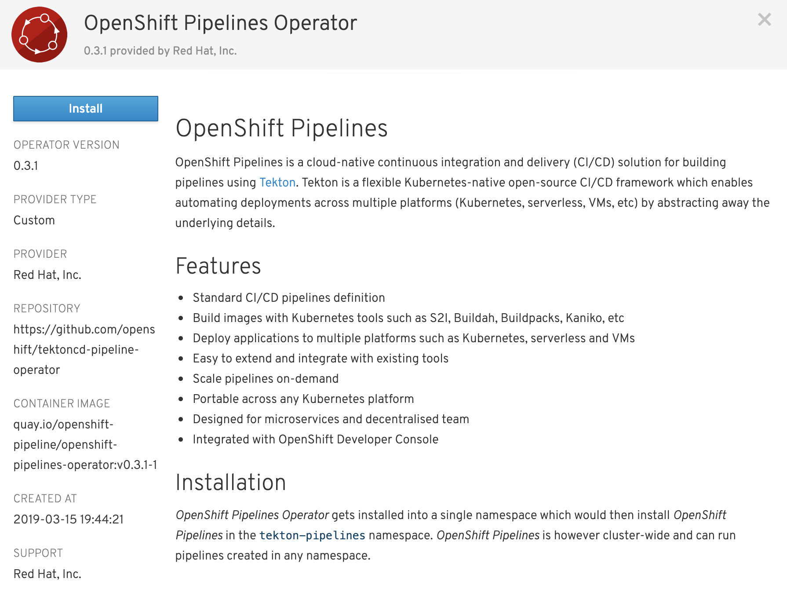
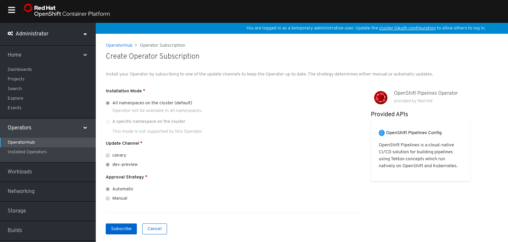
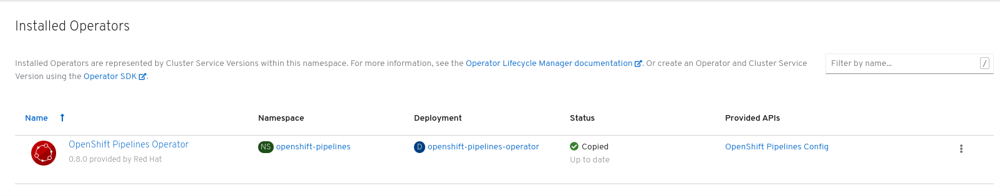

# Install OpenShift Pipelines

OpenShift Pipelines is provided as an add-on on top of OpenShift that can be installed via an operator that is available in the OpenShift OperatorHub.

Go to **Catalog > OperatorHub** in the Web Console. You can see the list of available operators for OpenShift, provided by Red Hat as well as a community of partners and open-source projects. 

Click on **Integration & Delivery** category to find **OpenShift Pipeline Operator**.

Click on **OpenShift Pipelines Operator**, **Continue**, and then **Install**

Click on **Subscribe** in order to subscribe to the installation and update channels.

The operator is installed when you see the status updated from `1 installing` to `1 installed`. This operator automates installation and updates of OpenShift Pipelines on the cluster and applies all configurations needed.

Click on `1 installed` to go to the installed operator in order to install OpenShift Pipelines.

That's all. The operator now installs OpenShift Pipelines on the cluster.
