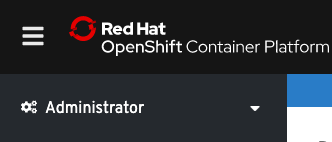
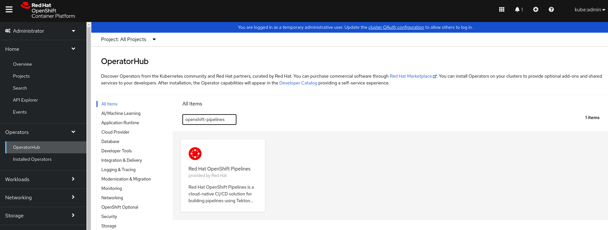
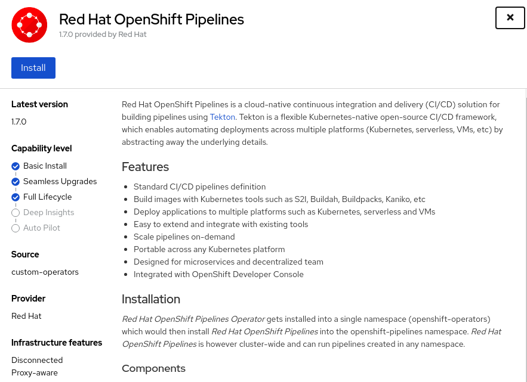
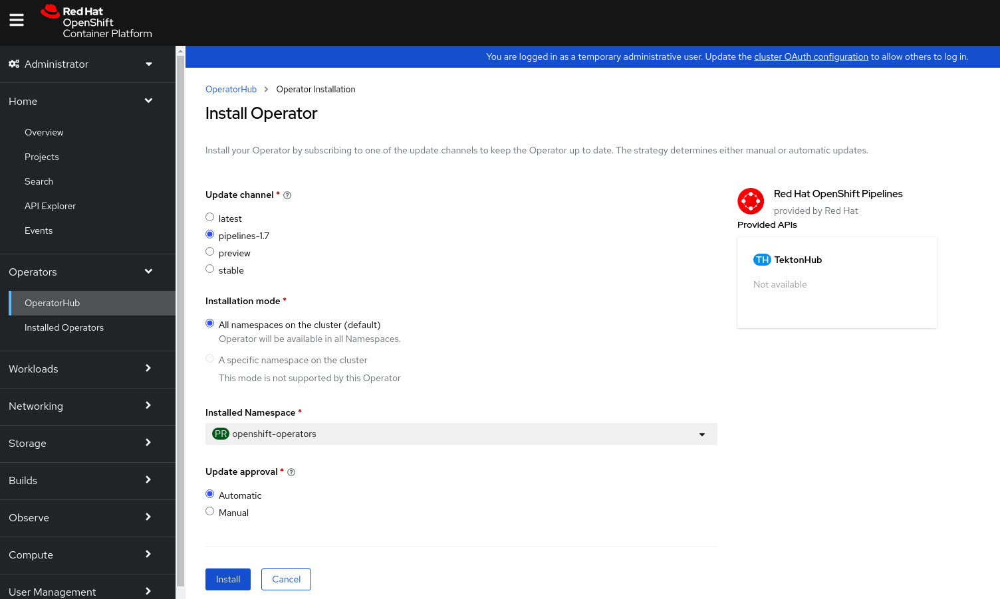
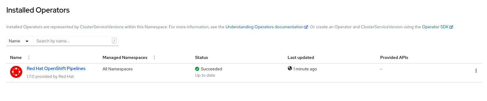
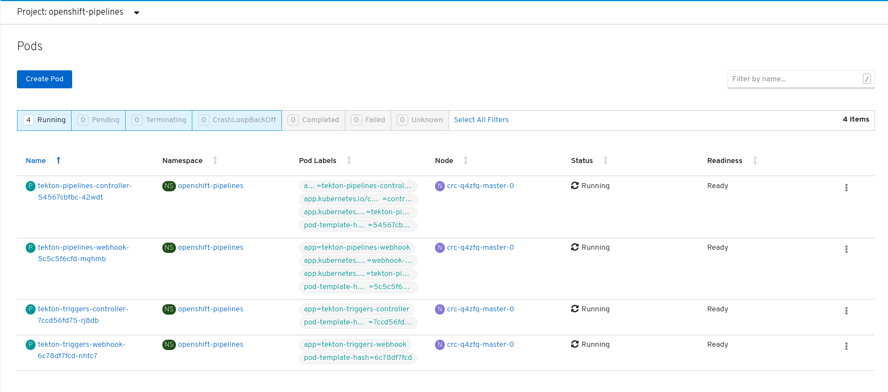

# Install OpenShift Pipelines

OpenShift Pipelines is provided as an add-on on top of OpenShift that can be installed via an operator that is available in the OpenShift OperatorHub.

To start, make sure you are on the **Administrator** perspective as shown below:



Go to **Operators > OperatorHub** in the Web Console. You can see the list of available operators for OpenShift provided by Red Hat as well as a community of partners and open-source projects.


In the search bar where it says `Filter by keyword...`, type OpenShift Pipelines to find the **Red Hat OpenShift Pipelines**:



Click on **Red Hat OpenShift Pipelines**, **Continue**, and then **Install**:



Leave the default settings and click on **Install** in order to install to the installation and update channels:



After clicking **Install**, you will be taken to the **Installed Operators** page. If you do not see the **Red Hat OpenShift Pipelines** as shown below, simply wait a moment while the **Red Hat OpenShift Pipelines** finishes installation:



That's all. The operator now installs OpenShift Pipelines on the cluster.

You can confirm the following by checking tekton-pipelines and tekton-triggers pods with `Running` state in `openshift-pipelines` namespace. If so, openshift-pielines have been installed on your cluster.



You can also confim by checking the status of TektonConfig CR
```yaml
$ oc get TektonConfig
NAME     VERSION   READY   REASON
config   devel     True    
```
